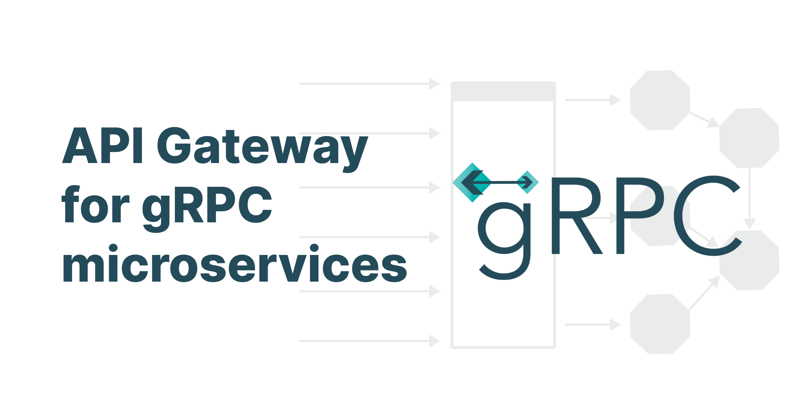
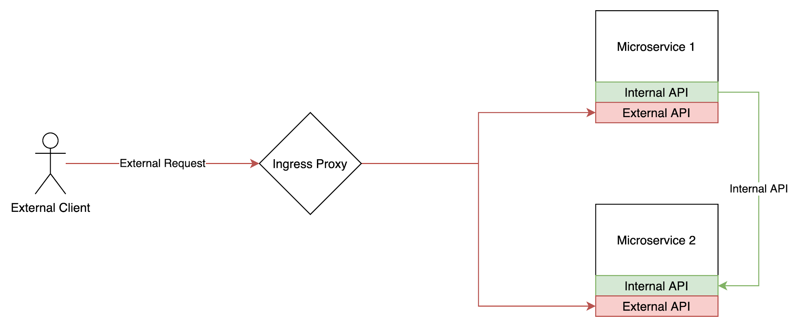
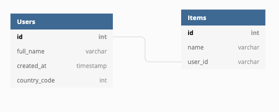
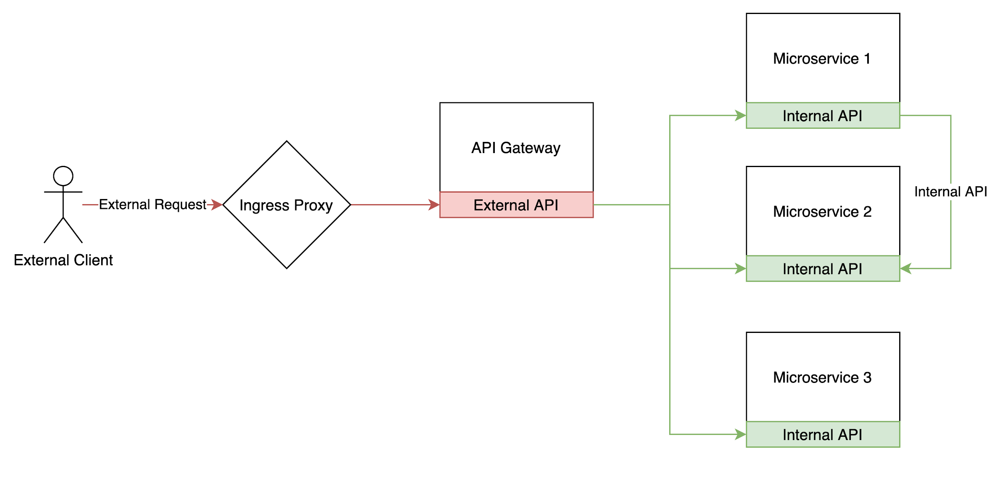
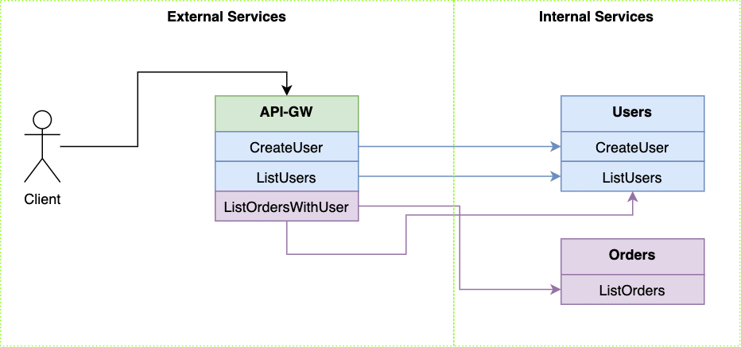
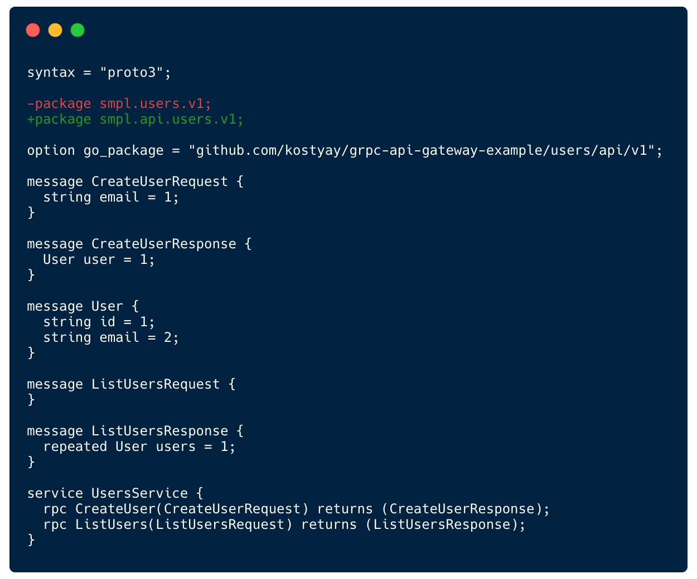
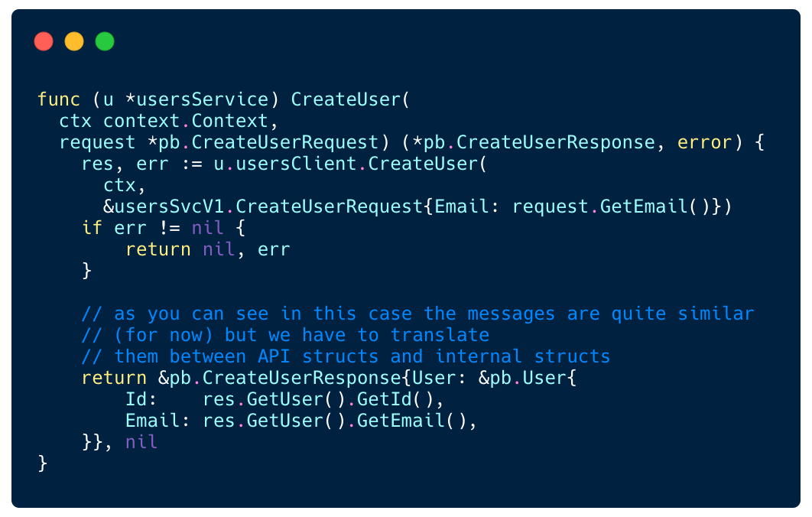
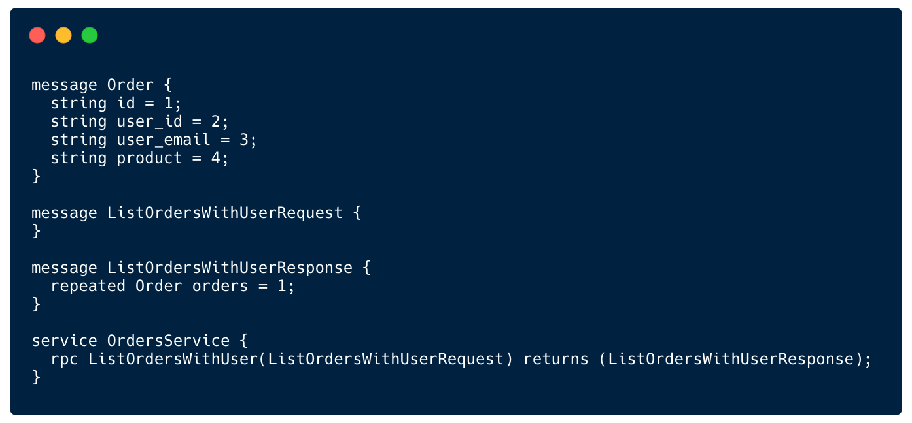
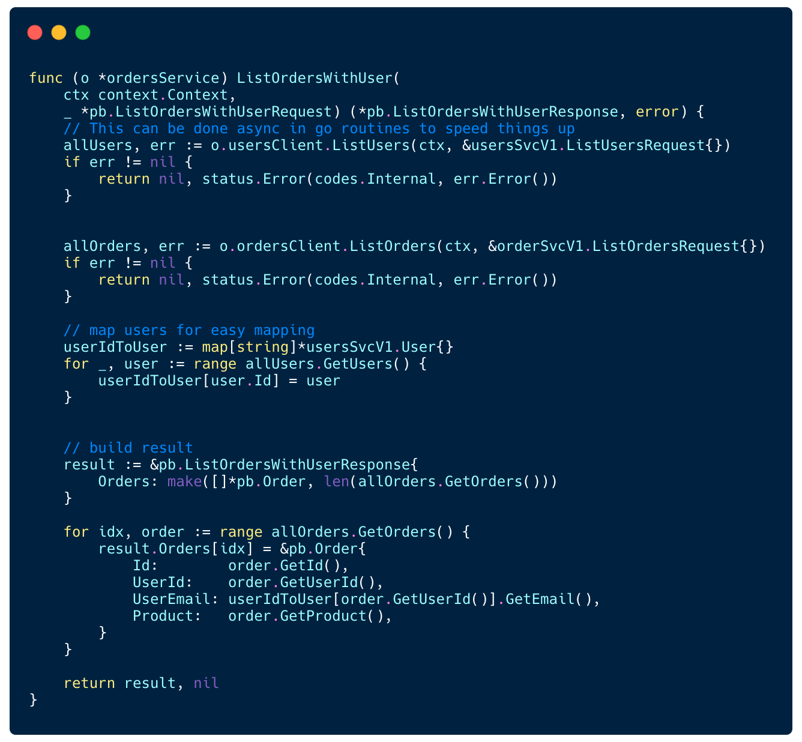

## API Gateway for gRPC microservices

### Rethinking external APIs

_This blog post builds on the knowledge from my previous gRPC posts ([Part 1: gRPC vs. REST](/grpc-introduction), [Part 2: A Breakdown of gRPC in Practice](/directory-structure-linting), and [Part 3: Using gRPC in your Front End Application](/grpc-web-frontend)), however it can also be read as a standalone._

More than a year has passed since we wrote the first line of code at [StackPulse](https://stackpulse.com/). Having previously used REST API, we wanted to use gRPC as our protocol of choice both for internal and external communication. Internal communication is done by our microservices communicating with each other. External communication is done by either the CLI utility or the Frontend Application.

Initially, our architecture looked like this:

A microservice would define 2 gRPC services — one internal and the other external. External APIs were directly open to the internet via the Ingress Proxy. Internal APIs, were, well, internal. They were not exposed via the ingress proxy and had different security requirements and validations.

External API endpoints had several middlewares that handled authentication and authorization.

We worked like that for a few months, but had few issues with this approach:

1. Wide attack surface - We had too many endpoints accessible via the internet. Each microservice had several API’s that were external.

    It started to confuse our engineers, as they puzzled over some questions:

* Is there an application flow that could cause a certain function to be called externally?
* Should I filter sensitive data when returning it as it may have been called from an external endpoint?
* Do I need to reimplement this endpoint for internal use if I want to return some internal data?

    A wrong answer to any one of these questions could lead to potential security issues. Mistakenly a developer could return sensitive data via an external endpoint, or someone could forget to add authz/authn middleware to one of the external endpoints, which could then cause a compromise. Ultimately we wanted to minimize the attack surface and have as little as possible endpoints externally accessible. In fact, we want to have 1 or 2 microservices that are internet facing and everything else to be internal.

2. Data Consolidation - With microservices you may have relational data scattered across different services. The product will eventually require that you query and display this data. In relational databases speak, there will come a time when you want to JOIN over data that is managed by different microservices. But because microservices are not supposed to access data they don’t own, you have to use API calls to achieve that and you will need some application logic to process and merge that data.

TL;DR: Fewer services exposed externally is more secure.

### Data Consolidation with gRPC

Let’s unpack a DataConsolidation example to examine this further.

Suppose you have the following logical data model:

In microservice architecture, it’s possible for each data entity in the chart to be managed by a different microservice —  it could even be a different database storage driver altogether.

You are now faced with a new product requirement to create an inventory view page in your web application that is to display Items grouped by Users:

1. User 1
    1. Item 1
    2. Item 2
    3. Item 3
2. User 2
    4. Item 4
    5. Item 5
    6. Item 6

In essence, you need to perform a JOIN over data managed by 2 separate microservices that provide gRPC methods to help you.

As you can imagine, this is a very common use case. In fact in many cases the JOIN logic could be more complex.

Here, we’re faced with a dilemma: what service should implement the ListItemsGroupedByUsers() rpc call? Should it be the Web Application? Should the users service implement it?

As is usually the case, the answer to this question is, “well it depends” — and there could be several solutions for it.

Initially we started by implementing this logic in the web application. But quickly we’ve had our  web application making 10s of gRPC requests which slowed the site load down significantly. Besides the many network requests, the consolidation logic running on the client side is less efficient than running on a backend microservices (memory footprint, network latency between user browser and backend).

### The API Gateway (AKA: Backend for Frontend)

We started researching the best and most elegant way to solve this, with the following requirements in mind:

1. A single gateway for all requests — with all the security logic (authz/authn) centralized
2. It should be easy to join/filter related data in an efficient manner
3. The service should be scalable and be able to handle a lot of traffic and have no state of its own
4. Ultimately, the API defined by this service should become our “public API”, therefore it should be simple to generate API clients from it

As we worked on this, we kept thinking: Surely_ someone_ must have come across this issue before. And of course, this was indeed the case.

There are many references to this challenge, namely [Backend for Frontend/API Gateway](https://microservices.io/patterns/apigateway.html).

The API Gateway is implemented as a standalone microservice that has no state. It maintains multiple gRPC clients with connections open to each of the microservices. It implements the external API and translates external requests to one or more internal API requests. In case there are several requests to be made they can be done in parallel using goroutines, the data can then be joined together and processed to build a response object that contains only the data needed.

#### Advantages of the API gateway:

1. Single external service and the main entrypoint of all requests into the system.
2. Implements the authentication and authorization logic (RBAC) in one place. There is no place for mistakes on the engineers’ side when building internal microservices.
3. Defines the public API endpoints and generates the API client for the external api.
4. Responsible for data consolidation in an efficient manner.
5. Single place to implement application level caching.

#### Disadvantages of API gateway:

Not everything is advantageous with API Gateways, but while there are some disadvantages, the advantages outweigh them for us at StackPulse.

The main thing you need to consider is that there will be _some _message and endpoint duplication (but that's not necessary a bad thing):

1. A message or an endpoint defined in an internal service that needs to be externally available will have to be redefined in the gateway. However, over time, you will find that the external objects and internal objects are starting to differ, ever so slightly. The data fields you want externally are not necessarily the same as the ones you want internally.
2. You will need to write some application logic that converts between one or several internal proto messages to API gateway proto messages. This will be mundane data transformation code, and it's easy to make mistakes writing it.
3. You will have to update 2 services in any case where you need to expose some additional data. Let's say you want to add a new external attribute called _birthday_date_ to the _User_ object. You will have to update the proto messages both in the API service and the internal service responsible for the users domain.

### Example

Let’s examine the following example that demonstrates a very common use case you will encounter creating API Gateways

Here we have 2 internal microservices — Users and Orders —  and we have the API-GW microservice.

#### Users Service

Since we are just starting the _CreateUser_ and _ListUsers_ methods in the API-GW match the ones in Users service. The data they both exchange is essentially the same. Nevertheless, like we previously mentioned, we have to define gRPC service in API-GW with all the messages and methods, as it may change in the future.

_Diff view of API-GW User’s gRPC service vs Users gRPC service_

API-GW implements logic for translating incoming external requests and responses into internal requests after forwarding them to the Users service.

_Example of CreateUser method in API-GW_

#### Orders Service

On the other hand, the implementation of OrdersService logic in the API-GW is more complex.

In our case it has a method called ListOrdersWithUser which returns a combination of data returned by the internal Users service and the Orders service.

_The Order object contains the user_email field which comes from the Users microservice_

In this case the implementation of ListOrdersWithUser method will look like this:

_Query both internal services and build combined data view_

The example above demonstrates the challenges of implementing an API Gateway. You can find the full source code [here](https://github.com/kostyay/grpc-api-gateway-example).

### Conclusion

We always strive to “get it right” the first time. However, when developing software you can never predict the challenges you may face in a month or two, or the important use cases that invalidate your design.

At first, we thought that having external api for each microservice would  be great. Each service wouldbe responsible for defining its external API. But we quickly realized that this freedom is not really needed. We found that we needed a way to query and consolidate data from several microservices; and when this data is distributed, a new entity must be introduced — the API Gateway. We have been working with the API gateway for the last 6 months and are extremely happy with this solution. Unfortunately, there aren’t currently any open source products offering such flexibility for gRPC.
